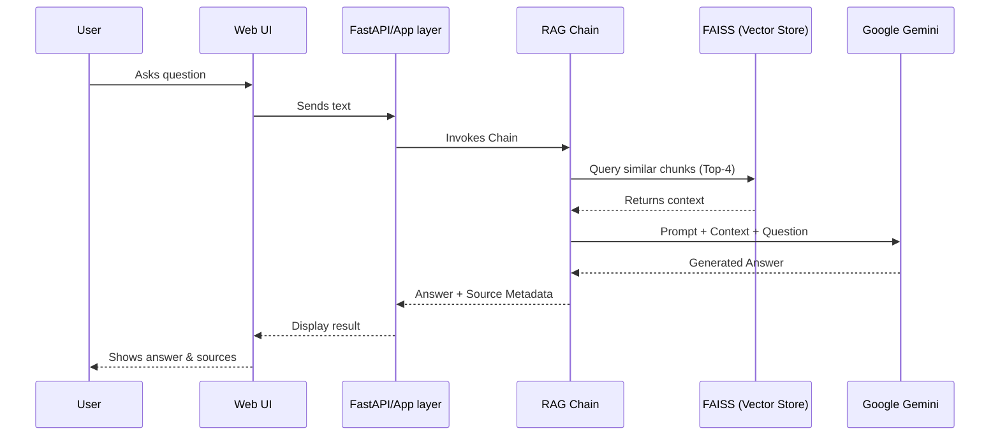

# 🏦 RBI NBFC Chatbot - Intelligent Regulatory Assistant


> **A sophisticated RAG-powered chatbot** using Google Gemini AI, FAISS vector search, and 716 document chunks from official RBI guidelines.

---

## 🏗 Architecture



---

## 🚀 Quick Start

### Option A: Docker (Recommended)

1. **Build the image**
   ```bash
   make docker-build
   # OR
   docker build -t rbi-bot .
   ```

2. **Run the container**
   ```bash
   # Ensure .env exists with GOOGLE_API_KEY
   make docker-run
   # OR
   docker run -p 8501:8501 --env-file .env rbi-bot
   ```

3. **Access**
   Open [http://localhost:8501](http://localhost:8501)

### Option B: Local Development

1. **Setup**
   ```bash
   make install
   cp .env.example .env  # Add your GOOGLE_API_KEY
   ```

2. **Run**
   ```bash
   make run
   ```

---

## 📋 What This Does

✨ **330-page RBI Master Direction** → **716 smart chunks** → **Accurate answers with citations**

### Interfaces Available

| Interface | Command | Use Case |
|-----------|---------|----------|
| **🌐 Web UI** | `make run` | Best for demonstrations |
| **💬 Interactive CLI** | `python examples/demo_interactive.py` | Quick Q&A sessions |
| **🔌 REST API** | `python examples/demo_api.py` | Integration, automation |

---

## 🛠 Development

This project uses modern Python tooling.

```bash
# Linting (Ruff + Mypy)
make lint

# Testing (Pytest)
make test
```

### Technical Stack

- **LLM**: Google Gemini 2.5 Flash
- **Embeddings**: Google text-embedding-004 (768-dim)
- **Vector DB**: FAISS (716 chunks)
- **Framework**: LangChain 0.2.16
- **Container**: Docker Multi-stage Build

---

## 📁 Project Structure

```
chatbot-langchain/
├── .github/              # CI/CD Workflows
├── src/                  # Source code
│   └── rbi_nbfc_chatbot/
│       ├── chains/       # RAG pipeline logic
│       ├── utils/        # Document processing
│       └── api/          # FastAPI server endpoints
├── tests/                # Pytest suite
├── data/                 # Vector store & documents
├── Dockerfile            # Container definition
├── Makefile              # Task runner
└── pyproject.toml        # Tool configuration
```

---

## 📈 Performance & Specs

- ⚡ **2-5 seconds** per query
- 🎯 **716 chunks** searchable
- 🔍 **Top-4** document retrieval
- 💾 **~600MB** Docker Image size (Optimized)

---

**Built with ❤️ using Google Gemini, LangChain, and FAISS**
